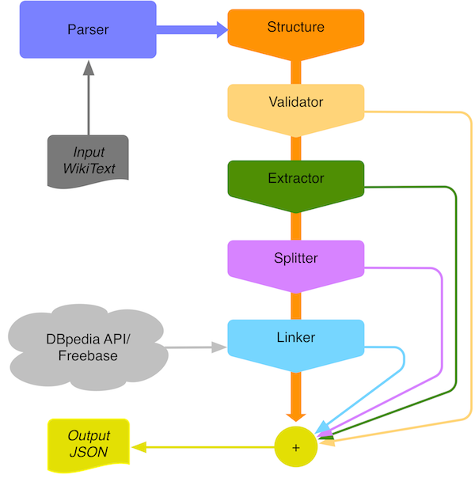

# JSONpedia Documentation

## Abstract
This document contains developer documentation about the JSONpedia library. 

## Processing Pipeline
The picture below describes (a simplified view) of the processing pipeline.
The pipeline is fed by the parsing events generated by the WikiText parser,
such events propagate through the different Processors. 
Every processor store data specific data or modify the stream of events.
The final composition of the output of every processor is returned as JSON output.

  

## Processors
Processors can be categorized as:

- Structure
- Extractors
- Linkers
- Splitters
- Validator

### Structure
The Structure Processor receives a stream of WikiText parsing events and builds a 1-1 JSON 
representation of the document DOM.

### Extractors
Extractors are specific Processors that collect a certain type of data from the event stream. 

For example the __SectionsExtractor__ collects the list of all sections detected in the document stream.

### Linkers
A Linker is a Processor which links the detected document entities to other information acquired from external sources. 
An example of Linker is the __FreebaseLinker__ which connects an entity to the same representation in Freebase if any.

### Splitters
A Splitter is a Processor able to cut sub trees of the JSON document built by the Structure processor.  
An example of Splitter is the __TableSplitter__ which extract the JSON structures representing the 
tables declared in the document.

### Validator
A Validator is a Processor performing the check of data structures parsed from a document.

## Code samples
Some code usage notes.
A Wikipedia __entity__ is simply a Wikipedia page (identified by a URL). It can be written as full URL or shortened
using the syntax <lang>:<Page_Name>. 
When specified just the entity the WikiText markup is retrieved using the Wikipedia APIs.
It is also possible to provide wikiText markup programmatically.

### Process Entity by id

Process EN Wikipedia entity Albert Einstein with default processors and return the Jackson JsonNode representation.  

```java
JsonNode root = JSONpedia.instance().process("en:Albert Einstein").json();
```

### Process Entity by URL

Process EN Wikipedia entity (written extensively) Albert Einstein with default processors 
and return the Jackson JsonNode representation.

```java
JsonNode root = JSONpedia.instance().process("http://en.wikipedia.org/wiki/Albert_Einstein").json();
```

### Process Entity as Map

Process EN Wikipedia entity Albert Einstein with default processors and return the java.util.Map<String,?> representation.

```java
Map<String,?> root = JSONpedia.instance().process("http://en.wikipedia.org/wiki/Albert_Einstein").map();
```

### Process Entity as HTML

Process EN Wikipedia entity Albert Einstein with default processors and return the HTML rendering.

```java
String html = JSONpedia.instance().process("en:Albert Einstein").html()
```

### Process WikiText

Process EN Wikipedia entity Albert Einstein over explicitly passed WikiText with default processors and return 
the Jackson JsonNode representation.

```java
JsonNode root = JSONpedia.instance()
                .process("en:Albert Einstein")
                .text("A really ''short'' description of Albert Einstein")
                .json();
```

### Process Entity with flags

Process EN Wikipedia entity Albert Einstein with specified processors and return the Jackson JsonNode representation.

```java
JsonNode root = JSONpedia.instance()
                    .process("en:Albert Einstein")
                    .flags("Linkers,Validate,Structure")
                    .json();
```

### Filter Entity

Process EN Wikipedia entity Albert Einstein (with specified processors) filtering out everything it is not a reference 
and return the Jackson JsonNode representation.

```java
JsonNode root = JSONpedia.instance()
                    .process("en:Albert Einstein")
                    .flags("Linkers,Validate,Structure")
                    .filter("__type:reference")
                    .json();
```

## Low level API code samples

### Parse WikiText and handle events

```java
WikiTextHRDumperHandler handler = new WikiTextHRDumperHandler();
WikiTextParser parser = new WikiTextParser(handler);
parser.parse( new DocumentSource(new URL("http://test.com/url"), "This is a ''WikiText'' example") );
System.out.println( handler.getContent() );
```
Will produce as output:

```bash
Begin Document
Text: 'This is a '
ItalicBold: 2
Text: 'WikiText'
ItalicBold: 2
Text: ' example'
End Document
```
### Create JSONfilter from String
```java
final JSONFilter filter = DefaultJSONFilterEngine.parseFilter("__type:link>__type:reference");
System.out.println( filter.humanReadable() );
```

Will produce:

```bash
object_filter(__type=link,)>object_filter(__type=reference,)>null
```

### Applying a Converter
```java
ConverterManager converterManager = new DefaultConverterManager();
// Define a Converter which extract the content field of the matching objects and writes out it in upper case.
Converter converter = new Converter() {
    @Override
    public void convertData(Map<String, ?> data, Serializer serializer, Writer writer)
        throws ConverterException {
        try {
            writer.append( data.get("content").toString().toUpperCase() );
        } catch (IOException ioe) {
            throw new RuntimeException(ioe);
        }
    }
};

// Register the converter to the manager to match objects of type reference. 
converterManager.addConverter(
        (JSONObjectFilter) DefaultJSONFilterEngine.parseFilter("__type:reference"),
        converter
);

// Declare data structures to host the conversion output data.
ByteArrayOutputStream serializerBuffer = new ByteArrayOutputStream();
JSONSerializer serializer = new JSONSerializer(serializerBuffer);
ByteArrayOutputStream writerBuffer = new ByteArrayOutputStream();
Writer writer = new PrintWriter(writerBuffer);
JsonNode data = // Arbitrary data. May be generated as: JSONpedia.instance().process("en:London").flags("Structure").json();

// Run the conversion and close output writers.
converterManager.process(data, serializer, writer);
serializer.close();
writer.close();

System.out.println( serializerBuffer.toString()) );
System.out.println( writerBuffer.toString()) );
```

### Applying a ScriptableConverter
```java
// Defines the Python script to generate the scriptable converter.
String script =
        "def convert_data(d):\n" +
        "    return {'link' : '%s %s' % (d['label'], functions.as_text(d['content'])) }\n" +
        "\n" +
        "def convert_hr(d):\n" +
        "    return '<a href=\"%s\">%s</a>' % (d['label'], functions.as_text(d['content']))";

// Defines the converter.
ScriptableConverter converter = ScriptableConverterFactory.getInstance().createConverter(script);
ConverterManager converterManager = new DefaultConverterManager();
// Sets the converter to apply to objects of type reference.
converterManager.addConverter(
        (JSONObjectFilter) DefaultJSONFilterEngine.parseFilter("__type:reference"),
        converter
);

// Declare data structures to host the conversion output data.
ByteArrayOutputStream serializerBuffer = new ByteArrayOutputStream();
JSONSerializer serializer = new JSONSerializer(serializerBuffer);
ByteArrayOutputStream writerBuffer = new ByteArrayOutputStream();
Writer writer = new BufferedWriter(new OutputStreamWriter(writerBuffer));
JsonNode data = // Arbitrary data. May be generated as: JSONpedia.instance().process("en:London").flags("Structure").json();

// Run the conversion and close output writers.
converterManager.process(data, serializer, writer);
serializer.close();
writer.close();

System.out.println( serializerBuffer.toString()) );
System.out.println( writerBuffer.toString()) );
```

### Handle Parsing events

TODO

### Write custom extractor

TODO

### Write custom template handler

TODO

### Query MongoDB

TODO

### Query ElasticSearch

TODO
